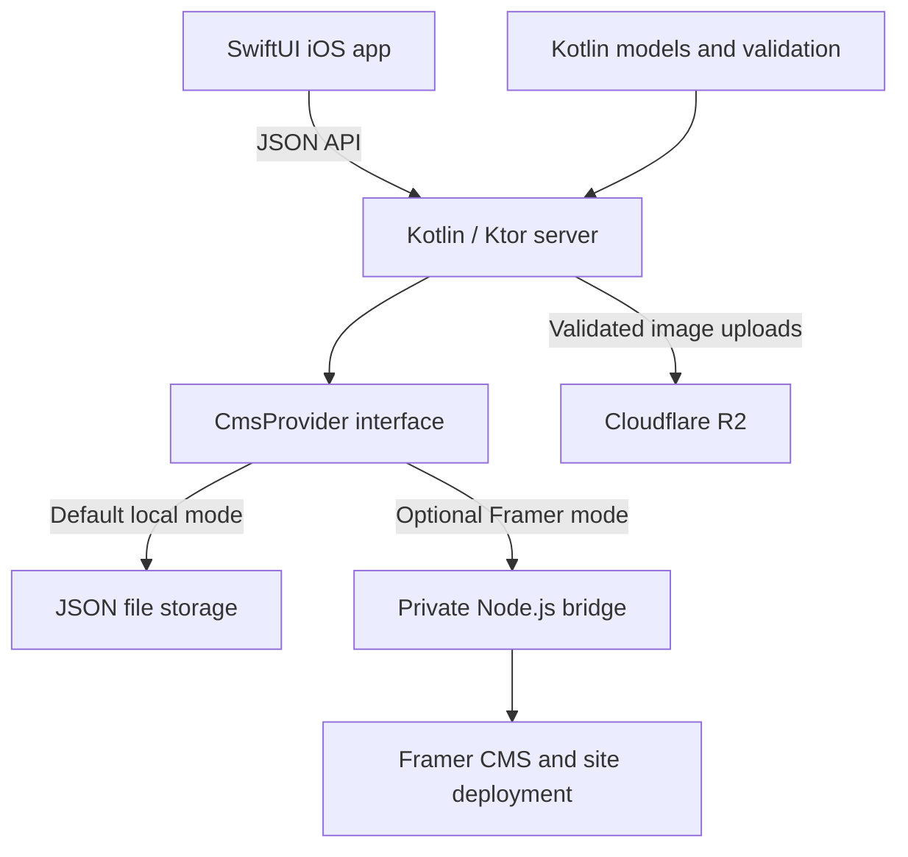

# CMS Editor

### A native iOS app for managing my Framer blog

I built CMS Editor to manage the blog on my personal website from my phone. It brings writing, image uploads, draft management, and site deployment into a focused SwiftUI app, backed by a Kotlin API that handles validation, access control, and communication with Framer.

This project brings together my work across mobile development, backend APIs, third-party integrations, and deployment infrastructure. It is an evolving personal tool, with a working local development mode and optional Framer and Cloudflare R2 integrations.

**Stack:** SwiftUI · Swift · Kotlin · Ktor · Kotlin Multiplatform · Node.js · Framer API · Cloudflare R2 · Docker · Cloudflare Tunnel

## What I built

- **Native post editing:** Create, edit, preview, and delete posts with titles, dates, body text, optional subheadings, and links.
- **Website profiles:** Save API connections and switch between website IDs, with access tokens stored separately in the iOS Keychain.
- **Photo uploads:** Choose a photo or use the camera, upload it through the API to R2, and attach its URL, alt text, and display size to a post.
- **Publishing controls:** Change a Framer CMS item's draft/published status and trigger a separate site deployment from the app.
- **Local persistence:** Run the API with JSON file storage so post edits survive restarts without Framer credentials.
- **Self-hosting setup:** Package the backend and private Framer bridge in Docker, with a Windows deployment workflow using Cloudflare Tunnel for HTTPS access.

In Framer mode, **Publish** changes a CMS item's status. **Deploy site** publishes and deploys the entire Framer project, including other pending project changes.

## How it works



The mobile app talks to one API. Ktor authorizes each website request, validates content, and delegates CMS operations through `CmsProvider`. In Framer mode, a private Node.js service calls the Framer SDK. Framer and R2 credentials stay on the server.

## Engineering decisions

### Keep the CMS integration behind an interface

I used `CmsProvider` to keep API routes independent of the storage implementation. File storage supports local development, an in-memory provider supports tests, and the Framer provider connects the same API to a real CMS. This lets me develop the app without requiring access to an external service for every change.

### Keep the mobile experience native

The iOS client uses SwiftUI, `URLSession`, async/await, the system photo picker, and Keychain services, with no third-party iOS packages. Views delegate loading and mutations to a view model, while a dedicated API client handles requests and errors.

The Kotlin Multiplatform module contains the backend's serializable models and validation, with JVM and iOS targets configured. The current SwiftUI app uses its own Swift models over JSON; consuming the shared Kotlin module directly remains future work.

### Treat content validation as part of the workflow

The API validates required fields, dates, text lengths, and related fields. Images require alt text and a display size; links require link text. Image uploads check the actual image data, declared type, dimensions, and a 10 MiB size limit before storage.

The Framer bridge also checks collection fields and types. Updates preserve existing slugs and draft status, and unmapped Framer fields are left intact.

### Make access boundaries explicit

Local mode binds to loopback by default. Hosted mode requires configured access rules, with website-scoped owner, editor, and viewer roles. The backend includes write rate limits and structured audit events, while the app stores access tokens in Keychain and requires HTTPS for non-loopback API URLs.

The current hosted authentication mechanism uses static tokens. My next step toward a public multi-user service is a full identity and session system, alongside the remaining requirements in [SECURITY.md](SECURITY.md).

## Explore the code

| Area | Location | What to look for |
| --- | --- | --- |
| iOS application | [iosApp/](iosApp/) | SwiftUI features, view model, API client, and Keychain storage |
| Xcode project | [CMSEditor/CMSEditor.xcodeproj/](CMSEditor/CMSEditor.xcodeproj/) | iOS target referencing the sources in `iosApp/` |
| API and providers | [server/](server/) | Routes, authorization, persistence, Framer adapter, and image storage |
| Domain models | [shared/](shared/) | Kotlin data models and post validation |
| Framer bridge | [framer-bridge/](framer-bridge/) | Schema mapping, SDK operations, and bridge tests |
| Deployment | [deploy/windows/](deploy/windows/) | Docker builds, Compose configuration, and PowerShell startup tooling |

For a quick code review, start with the [API routes](server/src/main/kotlin/com/ansen/cms/server/Application.kt), [iOS view model](iosApp/Features/PostList/PostsViewModel.swift), and [Framer field mapping](framer-bridge/src/cms.mjs).

## Run locally

### Backend

Install JDK 21 and Gradle. The repository does not currently include a Gradle wrapper; the Docker build uses Gradle 8.12.1 with JDK 21.

From the repository root:

```sh
gradle :server:run
```

The API listens at `http://127.0.0.1:8080`. Open `http://127.0.0.1:8080/health` to check for `{"status":"ok"}`.

The default provider saves posts to `serverData/cms-posts.json`, relative to the server process's working directory. Local post editing requires no Framer or R2 credentials. Image uploads require R2 configuration, and local mode does not deploy a live site.

### iOS app

1. On a Mac with Xcode, open `CMSEditor/CMSEditor.xcodeproj`.
2. Select the `CMSEditor` scheme and an iPhone simulator. The app targets iOS 17+.
3. Start the backend on the same Mac, then run the app.
4. Add a website profile with API URL `http://127.0.0.1:8080` and website ID `personal-site`. No access token is needed for loopback development.

A physical iPhone needs a reachable HTTPS API; its loopback address points to the phone itself.

### Optional hosted integrations

- [Framer setup](FRAMER.md): Collection field mapping, provider configuration, and schema checks.
- [Windows deployment](deploy/windows/README.md): Docker Desktop, Cloudflare Tunnel, R2 configuration, and the optional Framer Compose overlay.
- [Security model](SECURITY.md): Current access controls and requirements before a public launch.

## Tests

The repository includes automated tests for the post lifecycle, website isolation, deployment configuration, Framer provider requests and failures, and image upload validation. Bridge tests cover schema mapping, preservation of existing fields, publishing behavior, authorization, and error handling using test doubles.

Run the backend tests from the repository root:

```sh
gradle :server:test
```

Run the bridge tests with Node.js 24+ and the pnpm version declared in its `package.json`:

```sh
cd framer-bridge
pnpm install --frozen-lockfile
pnpm test
```

These tests exercise local behavior without live Framer or R2 credentials. The deployment Dockerfile also runs the backend tests before building its runtime image. Live service integration and iOS UI verification are separate checks.

## Current scope and next steps

I am developing this as a personal CMS tool. The app supports multiple saved profiles and the local provider separates posts by website ID; each configured Framer provider currently serves one website and collection.

My next priorities are:

- Replace static access tokens with OIDC/JWT authentication and database-backed website roles.
- Add transactional persistence and backup/restore support for a broader multi-user service.
- Expand automated iOS and end-to-end integration coverage.
- Explore direct use of the shared Kotlin module and an Android client.

The current repository includes the iOS client; an Android app is not implemented yet.
